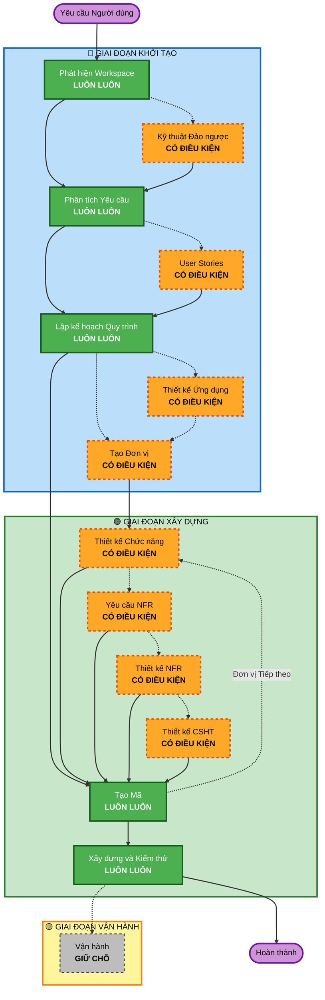

# Tổng quan Quy trình Thích ứng AI-DLC

**Mục đích**: Tài liệu tham khảo kỹ thuật cho model AI và các nhà phát triển để hiểu cấu trúc quy trình làm việc hoàn chỉnh.

**Lưu ý**: Nội dung tương tự tồn tại trong core-workflow.md (thông điệp chào mừng người dùng) và README.md (tài liệu). Sự trùng lặp này là CÓ CHỦ ĐÍCH - mỗi tệp phục vụ một mục đích khác nhau:

- **Tệp này**: Tài liệu tham khảo kỹ thuật chi tiết với biểu đồ Mermaid để tải ngữ cảnh model AI
- **core-workflow.md**: Thông điệp chào mừng người dùng với biểu đồ ASCII
- **README.md**: Tài liệu dễ đọc cho con người cho kho lưu trữ

## Vòng đời Ba Giai đoạn:

• **GIAI ĐOẠN KHỞI TẠO (INCEPTION)**: Lập kế hoạch và kiến trúc (Phát hiện Workspace + các giai đoạn có điều kiện + Lập kế hoạch Quy trình làm việc)
• **GIAI ĐOẠN XÂY DỰNG (CONSTRUCTION)**: Thiết kế, triển khai, xây dựng và kiểm thử (thiết kế theo đơn vị + Lập kế hoạch Mã / Tạo Mã + Xây dựng & Kiểm thử)
• **GIAI ĐOẠN VẬN HÀNH (OPERATIONS)**: Giữ chỗ cho các quy trình triển khai và giám sát trong tương lai

## Quy trình Làm việc Thích ứng:

• **Phát hiện Workspace** (luôn luôn) → **Kỹ thuật Đảo ngược** (chỉ brownfield) → **Phân tích Yêu cầu** (luôn luôn, độ sâu thích ứng) → **Các giai đoạn Có điều kiện** (khi cần thiết) → **Lập kế hoạch Quy trình làm việc** (luôn luôn) → **Tạo Mã** (luôn luôn, theo đơn vị) → **Xây dựng và Kiểm thử** (luôn luôn)

## Cách Hoạt động:

• **AI phân tích** yêu cầu của bạn, workspace và độ phức tạp để xác định giai đoạn nào là cần thiết
• **Các giai đoạn này luôn thực thi**: Phát hiện Workspace, Phân tích Yêu cầu (độ sâu thích ứng), Lập kế hoạch Quy trình làm việc, Tạo Mã (theo đơn vị), Xây dựng và Kiểm thử
• **Tất cả các giai đoạn khác là có điều kiện**: Kỹ thuật Đảo ngược, User Stories, Thiết kế Ứng dụng, Tạo Đơn vị, các giai đoạn thiết kế theo đơn vị (Thiết kế Chức năng, Yêu cầu NFR, Thiết kế NFR, Thiết kế Cơ sở hạ tầng)
• **Không có trình tự cố định**: Các giai đoạn thực thi theo thứ tự hợp lý cho nhiệm vụ cụ thể của bạn

## Vai trò của Nhóm Bạn:

• **Trả lời câu hỏi** trong các tệp câu hỏi chuyên dụng bằng cách sử dụng thẻ [Answer]: với các lựa chọn chữ cái (A, B, C, D, E)
• **Tùy chọn E có sẵn**: Chọn "Khác" và mô tả phản hồi tùy chỉnh của bạn nếu các tùy chọn được cung cấp không khớp
• **Làm việc theo nhóm** để xem xét và phê duyệt từng giai đoạn trước khi tiếp tục
• **Quyết định tập thể** về cách tiếp cận kiến trúc khi cần thiết
• **Quan trọng**: Đây là nỗ lực của cả nhóm - lôi kéo các bên liên quan phù hợp cho từng giai đoạn

## Quy trình làm việc Ba Giai đoạn AI-DLC:

**Mô tả Giai đoạn:**

**🔵 GIAI ĐOẠN KHỞI TẠO** - Lập kế hoạch và Kiến trúc

- Phát hiện Workspace: Phân tích trạng thái workspace và loại dự án (LUÔN LUÔN)
- Kỹ thuật Đảo ngược: Phân tích codebase hiện có (CÓ ĐIỀU KIỆN - Chỉ Brownfield)
- Phân tích Yêu cầu: Thu thập và xác thực yêu cầu (LUÔN LUÔN - Độ sâu thích ứng)
- User Stories: Tạo user stories và personas (CÓ ĐIỀU KIỆN)
- Lập kế hoạch Quy trình làm việc: Tạo kế hoạch thực hiện (LUÔN LUÔN)
- Thiết kế Ứng dụng: Xác định thành phần cấp cao và thiết kế lớp dịch vụ (CÓ ĐIỀU KIỆN)
- Tạo Đơn vị: Phân rã thành các đơn vị công việc (CÓ ĐIỀU KIỆN)

**🟢 GIAI ĐOẠN XÂY DỰNG** - Thiết kế, Triển khai, Xây dựng và Kiểm thử

- Thiết kế Chức năng: Thiết kế logic nghiệp vụ chi tiết theo đơn vị (CÓ ĐIỀU KIỆN, theo đơn vị)
- Yêu cầu NFR: Xác định NFR và chọn ngăn xếp công nghệ (CÓ ĐIỀU KIỆN, theo đơn vị)
- Thiết kế NFR: Kết hợp các mẫu NFR và thành phần logic (CÓ ĐIỀU KIỆN, theo đơn vị)
- Thiết kế Cơ sở hạ tầng: Ánh xạ tới các dịch vụ cơ sở hạ tầng thực tế (CÓ ĐIỀU KIỆN, theo đơn vị)
- Tạo Mã: Tạo mã với Phần 1 - Lập kế hoạch, Phần 2 - Tạo (LUÔN LUÔN, theo đơn vị)
- Xây dựng và Kiểm thử: Xây dựng tất cả các đơn vị và thực hiện kiểm thử toàn diện (LUÔN LUÔN)

**🟡 GIAI ĐOẠN VẬN HÀNH** - Giữ chỗ

- Vận hành: Giữ chỗ cho các quy trình triển khai và giám sát trong tương lai (GIỮ CHỖ)

**Các nguyên tắc Chính:**

- Các giai đoạn chỉ thực thi khi chúng mang lại giá trị
- Mỗi giai đoạn được đánh giá độc lập
- KHỞI TẠO tập trung vào "cái gì" và "tại sao"
- XÂY DỰNG tập trung vào "làm thế nào" cộng với "xây dựng và kiểm thử"
- VẬN HÀNH là giữ chỗ cho sự mở rộng trong tương lai
- Các thay đổi đơn giản có thể bỏ qua các giai đoạn KHỞI TẠO có điều kiện
- Các thay đổi phức tạp được xử lý đầy đủ KHỞI TẠO và XÂY DỰNG
