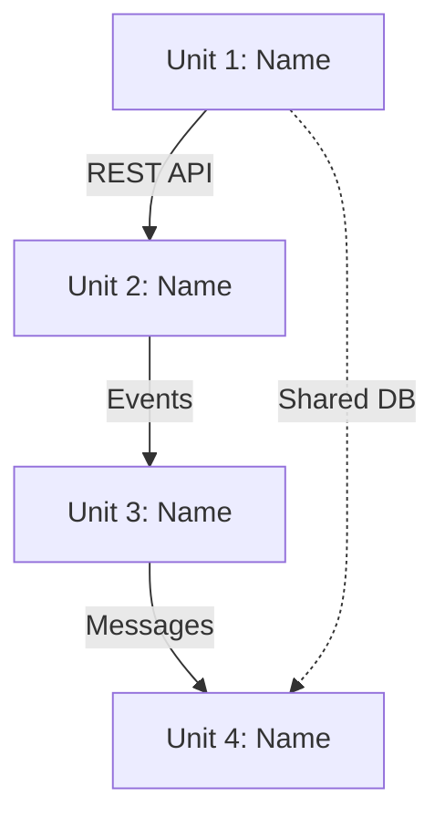

# Cross-Unit Design - Detailed Steps

## Purpose
**Define communication mechanisms and integration patterns between units**

Cross-Unit Design focuses on:
- Communication protocols between units (REST, messaging, shared data)
- Infrastructure sharing patterns (databases, queues, caches)
- Integration architecture decisions (sync vs async, event-driven vs request-response)
- System-level architectural patterns before individual unit implementation

**Note**: This defines HOW units communicate, not the specific contracts (those come in Functional Design)

## Prerequisites
- Units Generation must be complete
- Multiple units must exist with dependencies between them
- Execution plan must indicate Cross-Unit Design stage should execute

## Execute IF
- Multiple units exist (from Units Generation)
- Units have dependencies between them
- System needs integration patterns defined
- Complex inter-unit communication required

## Skip IF
- Single unit system
- No inter-unit dependencies
- Simple monolith architecture
- All units are completely independent

---

# PART 1: PLANNING & QUESTIONS

## Step 1: Analyze Unit Dependencies
- Read unit definitions from `aidlc-docs/inception/application-design/unit-of-work.md`
- Read unit dependencies from `aidlc-docs/inception/application-design/unit-of-work-dependency.md`
- Identify all inter-unit communication needs

## Step 2: Create Cross-Unit Design Plan
- Generate plan with checkboxes [] for cross-unit design
- Focus on communication mechanisms and integration patterns
- Each step should have a checkbox []

## Step 3: Generate Context-Appropriate Questions
**DIRECTIVE**: Analyze the unit dependencies to identify ALL areas where integration pattern decisions are needed. Be comprehensive in asking about communication mechanisms.

**CRITICAL**: Default to asking questions when there is ANY ambiguity about how units should integrate. Integration decisions are architectural and hard to change later.

- EMBED questions using [Answer]: tag format
- Focus on ANY ambiguities about communication patterns and integration approaches
- Generate questions wherever user input would improve integration architecture decisions
- **When in doubt, ask the question** - poor integration decisions are costly to fix

**Question categories to evaluate** (consider ALL categories):
- **Communication Patterns** - Ask about sync vs async, request-response vs event-driven, API calls vs messaging
- **Data Sharing** - Ask about shared databases vs database-per-service, data consistency requirements
- **Infrastructure Sharing** - Ask about shared queues, caches, load balancers, API gateways
- **Integration Protocols** - Ask about REST vs gRPC vs messaging, authentication patterns
- **Event Architecture** - Ask about event sourcing, CQRS, saga patterns for distributed transactions
- **Performance Requirements** - Ask about latency, throughput, scalability needs between units
- **Reliability Patterns** - Ask about circuit breakers, retries, fallback mechanisms
- **Deployment Coordination** - Ask about startup dependencies, health checks, service discovery

## Step 4: Store Plan
- Save as `aidlc-docs/inception/plans/cross-unit-design-plan.md`
- Include all [Answer]: tags for user input

## Step 5: Collect and Analyze Answers
- Wait for user to complete all [Answer]: tags
- **MANDATORY**: Carefully review ALL responses for vague or ambiguous answers
- **CRITICAL**: Add follow-up questions for ANY unclear responses - do not proceed with ambiguity
- Look for responses like "depends", "maybe", "not sure", "mix of", "somewhere between"
- Create clarification questions file if ANY ambiguities are detected
- **Do not proceed until ALL ambiguities are resolved**

## Step 6: Request Approval of Plan
- Ask: "**Cross-unit design plan complete. Review the plan in aidlc-docs/inception/plans/cross-unit-design-plan.md. Ready to proceed to generate integration options?**"
- DO NOT PROCEED until user confirms

---

# PART 2: OPTIONS GENERATION & SELECTION

## Step 7: Generate Integration Architecture Options

### Create contracts.md
Create `aidlc-docs/inception/cross-unit-design/contracts.md`:

```markdown
# Cross-Unit Integration Options

Based on your requirements, here are 2-3 recommended integration approaches:

## Option 1: [Approach Name]
**Communication Pattern**: [e.g., REST API + Event-driven]
**Data Strategy**: [e.g., Database per service]
**Infrastructure**: [e.g., API Gateway + Message Queue]

### How Units Communicate:
- Unit A → Unit B: [Mechanism and pattern]
- Unit B → Unit C: [Mechanism and pattern]
- Cross-cutting: [Shared infrastructure]

### Pros:
- [Benefit 1]
- [Benefit 2]
- [Benefit 3]

### Cons:
- [Limitation 1]
- [Limitation 2]

### Best For:
[When this approach works well]

---

## Option 2: [Approach Name]
[Similar structure]

---

## Option 3: [Approach Name] (if applicable)
[Similar structure]
```

### Create integration-patterns.md
Create `aidlc-docs/inception/cross-unit-design/integration-patterns.md`:

**CRITICAL**: Generate HIGH-LEVEL diagrams showing ONLY unit-to-unit communication patterns. Do NOT include internal unit components, detailed data flows, or infrastructure specifics.

```markdown
# Integration Pattern Diagrams

## Option 1: [Approach Name]

### High-Level Unit Communication


### Communication Summary
- Unit 1 → Unit 2: [Communication method]
- Unit 2 → Unit 3: [Communication method]
- Unit 3 → Unit 4: [Communication method]
- Shared Resources: [Brief list]

---

## Option 2: [Approach Name]
[Similar HIGH-LEVEL diagram structure - units and connections only]

---

## Option 3: [Approach Name] (if applicable)
[Similar HIGH-LEVEL diagram structure - units and connections only]
```

**DIAGRAM RULES**:
- Show ONLY units as boxes/nodes
- Show ONLY communication paths between units
- Label connections with communication method (REST, Events, Messages, etc.)
- NO internal unit components
- NO detailed infrastructure
- NO sequence diagrams
- Keep diagrams simple and focused on unit relationships

## Step 8: Present Options to User

Present completion message:

```markdown
# 🔗 Cross-Unit Design Options Ready

I've analyzed your unit dependencies and created 2-3 integration architecture options:

**Option 1**: [Brief description]
**Option 2**: [Brief description]  
**Option 3**: [Brief description] (if applicable)

Each option includes:
- Communication mechanisms between units
- Data sharing strategies
- Infrastructure requirements
- Pros/cons analysis
- Visual diagrams showing integration patterns

> **📋 <u>**REVIEW REQUIRED:**</u>**  
> Please examine the integration options at: `aidlc-docs/inception/cross-unit-design/`

> **🚀 <u>**WHAT'S NEXT?**</u>**
>
> **You may:**
>
> 🔧 **Request Changes** - Ask for modifications to the integration options
> ✅ **Select Option** - Choose your preferred integration approach and proceed to **CONSTRUCTION PHASE**

---
```

## Step 9: Wait for User Selection
- Do not proceed until user selects their preferred integration option
- Selection must be clear and unambiguous
- If user requests changes, update options and repeat selection process

## Step 10: Record Selection and Update Progress
- Log user's selection with timestamp in `aidlc-docs/audit.md`
- Update selected approach in both contracts.md and integration-patterns.md
- Mark Cross-Unit Design stage complete in `aidlc-docs/aidlc-state.md`
- Prepare for transition to CONSTRUCTION PHASE

---

## Critical Rules

### Planning Phase Rules
- Generate ONLY context-relevant questions about integration patterns
- Use [Answer]: tag format for all questions
- Analyze all answers for ambiguities before proceeding
- Resolve ALL ambiguities with follow-up questions
- Get explicit user approval before generating options

### Options Generation Rules
- Create 2-3 realistic integration approaches
- Include clear pros/cons for each option
- Provide visual diagrams for each approach
- Focus on mechanisms, not specific contract details
- Make options clearly distinguishable

### Selection Rules
- Present options clearly with visual aids
- Wait for explicit user selection
- Document selected approach for Construction phase reference
- Ensure selected approach addresses all unit dependencies

## Completion Criteria
- All planning questions answered and ambiguities resolved
- User approval obtained for the design plan
- 2-3 integration options generated with diagrams
- User selection of preferred integration approach
- Selected approach documented and ready for Construction phase
- Cross-Unit Design artifacts complete and approved