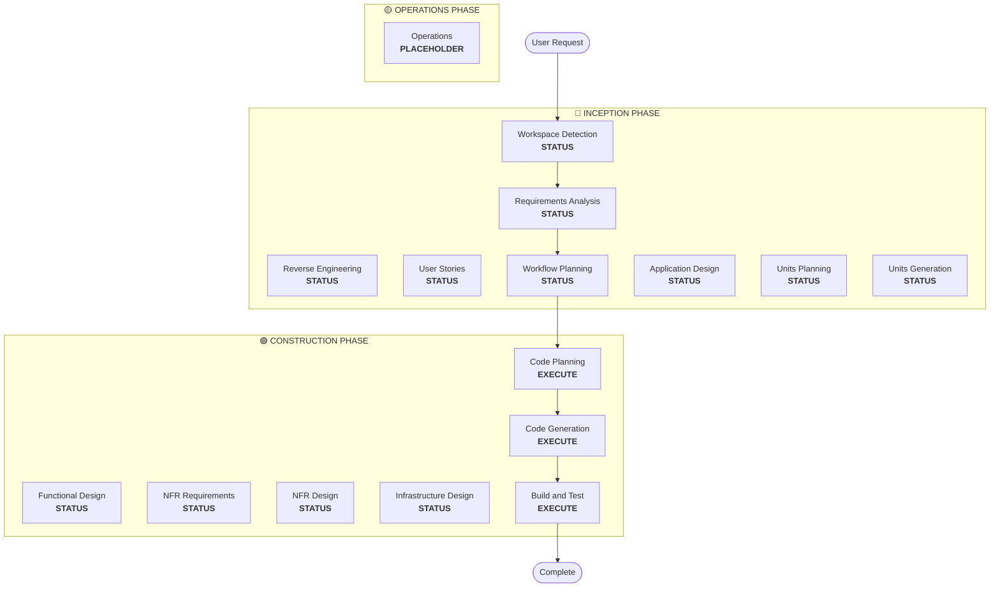

# Lập Kế hoạch Quy trình Làm việc (Workflow Planning)

**Mục đích**: Xác định giai đoạn nào cần thực hiện và tạo kế hoạch thực thi toàn diện

**Luôn thực thi**: Giai đoạn này luôn chạy sau khi hiểu các yêu cầu và phạm vi

## Bước 1: Tải Tất cả Ngữ cảnh Trước đó

### 1.1 Tải Artifact Kỹ thuật Đảo ngược (nếu brownfield)

- architecture.md
- component-inventory.md
- technology-stack.md
- dependencies.md

### 1.2 Tải Phân tích Yêu cầu

- requirements.md (bao gồm phân tích ý định)
- requirement-verification-questions.md (với câu trả lời)

### 1.3 Tải User Stories (nếu đã thực hiện)

- stories.md
- personas.md

## Bước 2: Phân tích Chi tiết Phạm vi và Tác động

**Bây giờ chúng ta đã có ngữ cảnh đầy đủ (yêu cầu + stories), hãy thực hiện phân tích chi tiết:**

### 2.1 Phát hiện Phạm vi Chuyển đổi (Chỉ Brownfield)

**NẾU dự án brownfield**, phân tích phạm vi chuyển đổi:

#### Chuyển đổi Kiến trúc

- **Thay đổi thành phần đơn lẻ** so với **chuyển đổi kiến trúc**
- **Thay đổi cơ sở hạ tầng** so với **thay đổi ứng dụng**
- **Thay đổi mô hình triển khai** (Lambda→Container, EC2→Serverless, v.v.)

#### Xác định Thành phần Liên quan

Đối với các chuyển đổi, xác định:

- **Mã cơ sở hạ tầng** cần cập nhật
- **Ngăn xếp CDK** yêu cầu thay đổi
- Cấu hình **API Gateway**
- Yêu cầu **Load balancer**
- Thay đổi **Mạng**
- Thích ứng **Giám sát/ghi nhật ký**

#### Tác động Chéo Gói

- Các gói **cơ sở hạ tầng CDK** yêu cầu cập nhật
- **Mô hình dùng chung** cần cập nhật phiên bản
- **Thư viện Client** yêu cầu thay đổi endpoint
- **Gói Kiểm thử** cần các kịch bản kiểm thử mới

### 2.2 Đánh giá Tác động Thay đổi

#### Các lĩnh vực Tác động

1. **Thay đổi hướng người dùng**: Điều này có ảnh hưởng đến trải nghiệm người dùng không?
2. **Thay đổi cấu trúc**: Điều này có thay đổi kiến trúc hệ thống không?
3. **Thay đổi mô hình dữ liệu**: Điều này có ảnh hưởng đến lược đồ cơ sở dữ liệu hoặc cấu trúc dữ liệu không?
4. **Thay đổi API**: Điều này có ảnh hưởng đến giao diện hoặc hợp đồng không?
5. **Tác động NFR**: Điều này có ảnh hưởng đến hiệu năng, bảo mật hoặc khả năng mở rộng không?

#### Tác động Lớp Ứng dụng (nếu có)

- **Thay đổi mã**: Điểm nhập mới, bộ điều hợp, cấu hình
- **Phụ thuộc**: Thư viện mới, thay đổi framework
- **Cấu hình**: Biến môi trường, tệp cấu hình
- **Kiểm thử**: Unit tests, integration tests

#### Tác động Lớp Cơ sở hạ tầng (nếu có)

- **Mô hình triển khai**: Lambda→ECS, EC2→Fargate, v.v.
- **Mạng**: VPC, nhóm bảo mật, cân bằng tải
- **Lưu trữ**: Khối lượng liên tục, lưu trữ chia sẻ
- **Mở rộng**: Chính sách tự động mở rộng, lập kế hoạch năng lực

#### Tác động Lớp Vận hành (nếu có)

- **Giám sát**: CloudWatch, số liệu tùy chỉnh, bảng điều khiển
- **Ghi nhật ký**: Tổng hợp nhật ký, ghi nhật ký có cấu trúc
- **Cảnh báo**: Cấu hình báo động, kênh thông báo
- **Triển khai**: Thay đổi đường ống CI/CD, chiến lược khôi phục

### 2.3 Ánh xạ Mối quan hệ Thành phần (Chỉ Brownfield)

**NẾU dự án brownfield**, tạo biểu đồ phụ thuộc thành phần:

```markdown
## Component Relationships

- **Primary Component**: [Package being changed]
- **Infrastructure Components**: [CDK/Terraform packages]
- **Shared Components**: [Models, utilities, clients]
- **Dependent Components**: [Services that call this component]
- **Supporting Components**: [Monitoring, logging, deployment]
```

Đối với mỗi thành phần liên quan:

- **Loại Thay đổi**: Lớn (Major), Nhỏ (Minor), Chỉ cấu hình (Configuration-only)
- **Lý do Thay đổi**: Phụ thuộc trực tiếp, mô hình triển khai, mạng
- **Ưu tiên Thay đổi**: Quan trọng, Quan trọng, Tùy chọn

### 2.4 Đánh giá Rủi ro

Đánh giá mức độ rủi ro:

1. **Thấp**: Thay đổi cô lập, dễ khôi phục, hiểu rõ
2. **Trung bình**: Nhiều thành phần, khôi phục vừa phải, một số ẩn số
3. **Cao**: Tác động toàn hệ thống, khôi phục phức tạp, ẩn số đáng kể
4. **Nghiêm trọng**: Quan trọng cho sản xuất, khôi phục khó khăn, độ không chắc chắn cao

## Bước 3: Xác định Giai đoạn

### 3.1 User Stories - Đã thực hiện hoặc Bỏ qua?

**Đã thực hiện**: Chuyển sang xác định tiếp theo
**Chưa thực hiện - Thực thi NẾU**:

- Nhiều chân dung người dùng
- Tác động trải nghiệm người dùng
- Cần tiêu chí chấp nhận
- Cần sự hợp tác nhóm

**Bỏ qua NẾU**:

- Refactoring nội bộ
- Sửa lỗi với khả năng tái tạo rõ ràng
- Giảm nợ kỹ thuật
- Thay đổi cơ sở hạ tầng

### 3.2 Thiết kế Ứng dụng - Thực thi NẾU:

- Cần thành phần hoặc dịch vụ mới
- Phương thức thành phần và quy tắc nghiệp vụ cần định nghĩa
- Cần thiết kế lớp dịch vụ
- Phụ thuộc thành phần cần làm rõ

**Bỏ qua NẾU**:

- Thay đổi trong ranh giới thành phần hiện có
- Không có thành phần hoặc phương thức mới
- Chỉ thay đổi triển khai thuần túy

### 3.3 Thiết kế (Lập kế hoạch/Tạo Đơn vị) - Thực thi NẾU:

- Mô hình dữ liệu hoặc lược đồ mới
- Thay đổi API hoặc endpoint mới
- Thuật toán phức tạp hoặc logic nghiệp vụ
- Thay đổi quản lý trạng thái
- Nhiều gói yêu cầu thay đổi
- Cần cập nhật cơ sở hạ tầng dưới dạng mã (IaC)

**Bỏ qua NẾU**:

- Thay đổi logic đơn giản
- Chỉ thay đổi UI
- Cập nhật cấu hình
- Triển khai đơn giản

### 3.4 Triển khai NFR - Thực thi NẾU:

- Yêu cầu hiệu năng
- Cân nhắc bảo mật
- Mối quan tâm về khả năng mở rộng
- Cần giám sát/khả năng quan sát

**Bỏ qua NẾU**:

- Thiết lập NFR hiện có đủ
- Không có yêu cầu NFR mới
- Thay đổi đơn giản không có tác động NFR

## Bước 4: Lưu ý Chi tiết Thích ứng

**Xem [depth-levels.md](../common/depth-levels.md) để giải thích về độ sâu thích ứng**

Đối với mỗi giai đoạn sẽ thực thi:

- Tất cả các artifact được định nghĩa sẽ được tạo
- Mức độ chi tiết trong các artifact thích ứng với độ phức tạp của vấn đề
- Mô hình xác định chi tiết phù hợp dựa trên đặc điểm vấn đề

## Bước 5: Phân tích Phối hợp Đa Mô-đun (Chỉ Brownfield)

**NẾU brownfield với nhiều mô-đun/gói**, phân tích các phụ thuộc và xác định chiến lược cập nhật tối ưu:

### 5.1 Phân tích Phụ thuộc Mô-đun

- Kiểm tra các phụ thuộc hệ thống xây dựng và biểu hiện phụ thuộc
- Xác định phụ thuộc thời gian xây dựng so với thời gian chạy
- Ánh xạ hợp đồng API và giao diện chia sẻ giữa các mô-đun

### 5.2 Xác định Chiến lược Cập nhật

Dựa trên phân tích phụ thuộc, quyết định:

- **Trình tự cập nhật**: Mô-đun nào phải được cập nhật trước do phụ thuộc
- **Cơ hội song song hóa**: Mô-đun nào có thể được cập nhật đồng thời
- **Yêu cầu phối hợp**: Tương thích phiên bản, hợp đồng API, thứ tự triển khai
- **Chiến lược kiểm thử**: Cách tiếp cận kiểm thử theo mô-đun so với tích hợp
- **Chiến lược khôi phục**: Kế hoạch phục hồi nếu xảy ra lỗi giữa trình tự

### 5.3 Ghi lại Kế hoạch Phối hợp

```markdown
## Module Update Strategy

- **Update Approach**: [Sequential/Parallel/Hybrid]
- **Critical Path**: [Modules that block other updates]
- **Coordination Points**: [Shared APIs, infrastructure, data contracts]
- **Testing Checkpoints**: [When to validate integration]
```

Xác định cho mỗi mô-đun bị ảnh hưởng:

- **Ưu tiên cập nhật**: Phải-cập-nhật-trước so với có-thể-cập-nhật-sau
- **Ràng buộc phụ thuộc**: Nó phụ thuộc vào gì, cái gì phụ thuộc vào nó
- **Phạm vi thay đổi**: Lớn (phá vỡ), Nhỏ (tương thích), Bản vá (sửa lỗi)

## Bước 6: Tạo Trực quan hóa Quy trình làm việc

Tạo biểu đồ luồng Mermaid hiển thị:

- Tất cả các giai đoạn theo trình tự
- Quyết định EXECUTE hoặc SKIP cho mỗi giai đoạn có điều kiện
- Kiểu dáng phù hợp cho mỗi trạng thái giai đoạn

**Quy tắc kiểu dáng** (thêm sau biểu đồ luồng):

```
style WD fill:#4CAF50,stroke:#1B5E20,stroke-width:3px,color:#fff
style CP fill:#4CAF50,stroke:#1B5E20,stroke-width:3px,color:#fff
style CG fill:#4CAF50,stroke:#1B5E20,stroke-width:3px,color:#fff
style BT fill:#4CAF50,stroke:#1B5E20,stroke-width:3px,color:#fff
style US fill:#BDBDBD,stroke:#424242,stroke-width:2px,stroke-dasharray: 5 5,color:#000
style Start fill:#CE93D8,stroke:#6A1B9A,stroke-width:3px,color:#000
style End fill:#CE93D8,stroke:#6A1B9A,stroke-width:3px,color:#000

linkStyle default stroke:#333,stroke-width:2px
```

**Hướng dẫn Kiểu dáng**:

- Hoàn thành/Luôn thực thi: `fill:#4CAF50,stroke:#1B5E20,stroke-width:3px,color:#fff` (Màu xanh lá Material với chữ trắng)
- EXECUTE có điều kiện: `fill:#FFA726,stroke:#E65100,stroke-width:3px,stroke-dasharray: 5 5,color:#000` (Màu cam Material với chữ đen)
- SKIP có điều kiện: `fill:#BDBDBD,stroke:#424242,stroke-width:2px,stroke-dasharray: 5 5,color:#000` (Màu xám Material với chữ đen)
- Bắt đầu/Kết thúc: `fill:#CE93D8,stroke:#6A1B9A,stroke-width:3px,color:#000` (Màu tím Material với chữ đen)
- Các container giai đoạn: Sử dụng màu Material nhạt hơn (INCEPTION: #BBDEFB, CONSTRUCTION: #C8E6C9, OPERATIONS: #FFF59D)

## Bước 7: Tạo Tài liệu Kế hoạch Thực thi

Tạo `aidlc-docs/inception/plans/execution-plan.md`:

````markdown
# Execution Plan

## Detailed Analysis Summary

### Transformation Scope (Brownfield Only)

- **Transformation Type**: [Single component/Architectural/Infrastructure]
- **Primary Changes**: [Description]
- **Related Components**: [List]

### Change Impact Assessment

- **User-facing changes**: [Yes/No - Description]
- **Structural changes**: [Yes/No - Description]
- **Data model changes**: [Yes/No - Description]
- **API changes**: [Yes/No - Description]
- **NFR impact**: [Yes/No - Description]

### Component Relationships (Brownfield Only)

[Component dependency graph]

### Risk Assessment

- **Risk Level**: [Low/Medium/High/Critical]
- **Rollback Complexity**: [Easy/Moderate/Difficult]
- **Testing Complexity**: [Simple/Moderate/Complex]

## Workflow Visualization


````

**Note**: Replace STATUS placeholders with actual phase status (COMPLETED/SKIP/EXECUTE) and apply appropriate styling

## Phases to Execute

### 🔵 INCEPTION PHASE

- [x] Workspace Detection (COMPLETED)
- [x] Reverse Engineering (COMPLETED/SKIPPED)
- [x] Requirements Elaboration (COMPLETED)
- [x] User Stories (COMPLETED/SKIPPED)
- [x] Execution Plan (IN PROGRESS)
- [ ] Application Design - [EXECUTE/SKIP]
  - **Rationale**: [Why executing or skipping]
- [ ] Units Planning - [EXECUTE/SKIP]
  - **Rationale**: [Why executing or skipping]
- [ ] Units Generation - [EXECUTE/SKIP]
  - **Rationale**: [Why executing or skipping]

### 🟢 CONSTRUCTION PHASE

- [ ] Functional Design - [EXECUTE/SKIP]
  - **Rationale**: [Why executing or skipping]
- [ ] NFR Requirements - [EXECUTE/SKIP]
  - **Rationale**: [Why executing or skipping]
- [ ] NFR Design - [EXECUTE/SKIP]
  - **Rationale**: [Why executing or skipping]
- [ ] Infrastructure Design - [EXECUTE/SKIP]
  - **Rationale**: [Why executing or skipping]
- [ ] Code Planning - EXECUTE (ALWAYS)
  - **Rationale**: Implementation approach needed
- [ ] Code Generation - EXECUTE (ALWAYS)
  - **Rationale**: Code implementation needed
- [ ] Build and Test - EXECUTE (ALWAYS)
  - **Rationale**: Build, test, and verification needed

### 🟡 OPERATIONS PHASE

- [ ] Operations - PLACEHOLDER
  - **Rationale**: Future deployment and monitoring workflows

## Package Change Sequence (Brownfield Only)

[If applicable, list package update sequence with dependencies]

## Estimated Timeline

- **Total Phases**: [Number]
- **Estimated Duration**: [Time estimate]

## Success Criteria

- **Primary Goal**: [Main objective]
- **Key Deliverables**: [List]
- **Quality Gates**: [List]

[IF brownfield]

- **Integration Testing**: All components working together
- **Operational Readiness**: Monitoring, logging, alerting working

````

## Bước 8: Khởi tạo Theo dõi Trạng thái

Cập nhật `aidlc-docs/aidlc-state.md`:

```markdown
# AI-DLC State Tracking

## Project Information
- **Project Type**: [Greenfield/Brownfield]
- **Start Date**: [ISO timestamp]
- **Current Stage**: INCEPTION - Workflow Planning

## Execution Plan Summary
- **Total Stages**: [Number]
- **Stages to Execute**: [List]
- **Stages to Skip**: [List with reasons]

## Stage Progress

### 🔵 INCEPTION PHASE
- [x] Workspace Detection
- [x] Reverse Engineering (if applicable)
- [x] Requirements Analysis
- [x] User Stories (if applicable)
- [x] Workflow Planning
- [ ] Application Design - [EXECUTE/SKIP]
- [ ] Units Planning - [EXECUTE/SKIP]
- [ ] Units Generation - [EXECUTE/SKIP]

### 🟢 CONSTRUCTION PHASE
- [ ] Functional Design - [EXECUTE/SKIP]
- [ ] NFR Requirements - [EXECUTE/SKIP]
- [ ] NFR Design - [EXECUTE/SKIP]
- [ ] Infrastructure Design - [EXECUTE/SKIP]
- [ ] Code Planning - EXECUTE
- [ ] Code Generation - EXECUTE
- [ ] Build and Test - EXECUTE

### 🟡 OPERATIONS PHASE
- [ ] Operations - PLACEHOLDER

## Current Status
- **Lifecycle Phase**: INCEPTION
- **Current Stage**: Workflow Planning Complete
- **Next Stage**: [Next stage to execute]
- **Status**: Ready to proceed
````

## Bước 9: Trình bày Kế hoạch cho Người dùng

```markdown
# 📋 Workflow Planning Complete

I've created a comprehensive execution plan based on:

- Your request: [Summary]
- Existing system: [Summary if brownfield]
- Requirements: [Summary if executed]
- User stories: [Summary if executed]

**Detailed Analysis**:

- Risk level: [Level]
- Impact: [Summary of key impacts]
- Components affected: [List]

**Recommended Execution Plan**:

I recommend executing [X] stages:

🔵 **INCEPTION PHASE:**

1. [Stage name] - _Rationale:_ [Why executing]
2. [Stage name] - _Rationale:_ [Why executing]
   ...

🟢 **CONSTRUCTION PHASE:** 3. [Stage name] - _Rationale:_ [Why executing] 4. [Stage name] - _Rationale:_ [Why executing]
...

I recommend skipping [Y] stages:

🔵 **INCEPTION PHASE:**

1. [Stage name] - _Rationale:_ [Why skipping]
2. [Stage name] - _Rationale:_ [Why skipping]
   ...

🟢 **CONSTRUCTION PHASE:** 3. [Stage name] - _Rationale:_ [Why skipping] 4. [Stage name] - _Rationale:_ [Why skipping]
...

[IF brownfield with multiple packages]
**Recommended Package Update Sequence**:

1. [Package] - [Reason]
2. [Package] - [Reason]
   ...

**Estimated Timeline**: [Duration]

> **📋 <u>**REVIEW REQUIRED:**</u>**  
> Please examine the execution plan at: `aidlc-docs/inception/plans/execution-plan.md`

> **🚀 <u>**WHAT'S NEXT?**</u>**
>
> **You may:**
>
> 🔧 **Request Changes** - Ask for modifications to the execution plan if required
> [IF any stages are skipped:]
> 📝 **Add Skipped Stages** - Choose to include stages currently marked as SKIP
> ✅ **Approve & Continue** - Approve plan and proceed to **[Next Stage Name]**
```

## Bước 10: Xử lý Phản hồi Người dùng

- **Nếu được duyệt**: Chuyển sang giai đoạn tiếp theo trong kế hoạch thực thi
- **Nếu yêu cầu thay đổi**: Cập nhật kế hoạch thực thi và xác nhận lại
- **Nếu người dùng muốn buộc bao gồm/loại trừ các giai đoạn**: Cập nhật kế hoạch tương ứng

## Bước 11: Ghi nhật ký Tương tác

Ghi nhật ký trong `aidlc-docs/audit.md`:

```markdown
## Workflow Planning - Approval

**Timestamp**: [ISO timestamp]
**AI Prompt**: "Ready to proceed with this plan?"
**User Response**: "[User's COMPLETE RAW response]"
**Status**: [Approved/Changes Requested]
**Context**: Workflow plan created with [X] stages to execute

---
```
