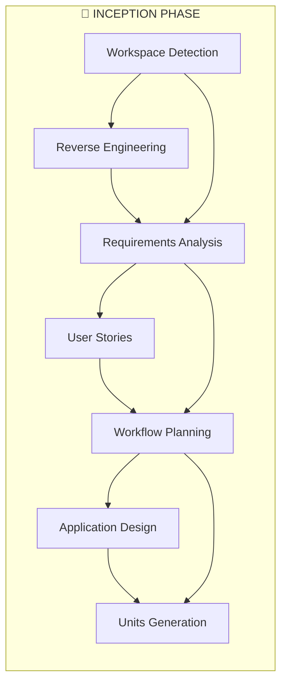
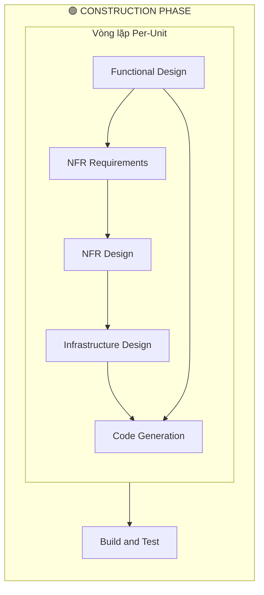

# Case Study: Ứng dụng AI-DLC Giải quyết Triệt để Pain Points của Dự án

Trong quá trình xây dựng và phát triển phần mềm, các đội ngũ thường phải đối mặt với nhiều "điểm nghẽn" (pain points) làm chậm tiến độ, gây lãng phí nguồn lực và giảm chất lượng sản phẩm như: yêu cầu nghiệp vụ chưa rõ ràng, thời gian code và fix bug kéo dài, hệ lụy tiềm ẩn khi nâng cấp, cũng như khối lượng công việc kiểm thử khổng lồ cực kỳ tốn kém.

Tài liệu Case Study dưới đây minh họa mô hình áp dụng thành công **AI-DLC (AI-Driven Development Life Cycle)** – phương pháp luận tiên tiến đưa AI trở thành người đồng hành xuất sắc xuyên suốt cả chu trình vòng đời dự án. Sự kết hợp hoàn hảo giữa tốc độ tự động hóa vượt trội của AI và tư duy ra quyết định sắc bén của con người (mô hình _Human-in-the-loop_) đã giúp chúng tôi tháo gỡ hoàn toàn các rào cản trên. Kết quả thực tế chứng minh AI-DLC không chỉ giải phóng lập trình viên khỏi những công việc thủ công, mà còn mang lại sự tối ưu tuyệt vời về thời gian, chi phí và chất lượng bàn giao cho khách hàng.

## I. Pain Points và Expect & Goals

### 1. BD không rõ ràng

- **Expect & Goals:**
  - AI giúp phát hiện các điểm chưa rõ ràng để đặt câu hỏi làm rõ.
  - Tạo User Stories để clear requirements.

### 2. Thời gian code, fix bug dài do hạn chế về kĩ thuật, hiểu biết nghiệp vụ

- **Expect & Goals:** AI code dựa trên requirements đã rõ ràng, con người chỉ preview và review => giảm thời gian code, fix bug.

### 3. Không đánh giá hết ảnh hưởng khi refactor, fix bug

- **Expect & Goals:** AI hỗ trợ đánh giá ảnh hưởng đầy đủ, chi tiết hơn để giảm degrade.

### 4. Tốn thời gian test

- **Expect & Goals:** AI hỗ trợ tạo code unit test, gen test cases manual để giảm effort của tester.

## II. Quy trình làm việc với AI-DLC

### INCEPTION PHASE

#### Workspace Detection

- **Vai trò tham gia:** `AI Agent`, `Developer`
- **Làm gì trong đó:** Kiểm tra môi trường dự án hiện tại là hoàn toàn mới (Greenfield) hay dự án đang có sẵn code (Brownfield), đọc tìm hiểu ngôn ngữ lập trình, hệ thống build.
- **Đầu ra:** Tài liệu trạng thái dự án.

#### Reverse Engineering

- **Vai trò tham gia:** `AI Agent`, `SA`, `Tech Lead`
- **Làm gì trong đó:** AI phân tích ngược codebase hiện có để làm rõ luồng nghiệp vụ, cấu trúc và API (nếu là Brownfield).
- **Đầu ra:** Các tài liệu phân tích hiện trạng.

#### Requirements Analysis

- **Vai trò tham gia:** `AI Agent`, `BA`, `Developer`, `Tester`
- **Làm gì trong đó:** AI tự đặt câu hỏi để rà soát các điểm chưa rõ trong yêu cầu ban đầu, từ đó thống nhất mô tả tính năng sẽ làm.
- **Đầu ra:** File danh sách câu hỏi làm rõ và file chốt yêu cầu chốt.

#### User Stories

- **Vai trò tham gia:** `AI Agent`, `BA`, `Developer`, `Tester`
- **Làm gì trong đó:** Thiết kế các kịch bản người dùng cuối (User Stories) từ tài liệu yêu cầu, phác thảo đối tượng người dùng.
- **Đầu ra:** Kịch bản người dùng, sơ đồ người dùng.

#### Workflow Planning

- **Vai trò tham gia:** `AI Agent`, `Developer`
- **Làm gì trong đó:** Dựa trên context đã thu thập, tổng hợp lên kế hoạch xem AI-DLC cần trải qua cụ thể những bước nào tiếp theo.
- **Đầu ra:** Kế hoạch thực thi workflow, sơ đồ phối hợp xử lý Workflow visualization (Mermaid diagram).

#### Application Design

- **Vai trò tham gia:** `AI Agent`, `SA`, `Tech Lead`
- **Làm gì trong đó:** Thiết kế high-level cho hệ thống (định dạng các Component, Service cần thiết nối với nhau ra sao).
- **Đầu ra:** Tài liệu thiết kế thành phần và API method.

#### Units Generation

- **Vai trò tham gia:** `AI Agent`, `Developer`
- **Làm gì trong đó:** Chia nhỏ kiến trúc ở phía trên thành nhiều khối công việc (Unit of work) logic gọn gàng để dễ code.
- **Đầu ra:** Danh sách các Unit of work.

### CONSTRUCTION PHASE

#### Functional Design (cho từng Unit)

- **Vai trò tham gia:** `AI Agent`, `Developer`
- **Làm gì trong đó:** Thiết kế chi tiết cho từng khối công việc: gồm mô hình toán, logic IF-ELSE, cấu trúc Database, luồng UI/UX.
- **Đầu ra:** Tài liệu thiết kế logic từng phần.

#### NFR Requirements (cho từng Unit)

- **Vai trò tham gia:** `AI Agent`, `SA`, `Security Engineer`, `Tech Lead`
- **Làm gì trong đó:** Định nghĩa các ràng buộc về mặt phi chức năng (Performance, Security, số lượng kết nối cao...) và chọn cấu hình Stack kỹ thuật.
- **Đầu ra:** Tài liệu định nghĩa phi chức năng.

#### NFR Design (cho từng Unit)

- **Vai trò tham gia:** `AI Agent`, `SA`, `Security Engineer`, `Tech Lead`
- **Làm gì trong đó:** Tìm ra các mẫu thiết kế giải quyết hiệu quả các yêu cầu phi chức năng ở bước trên.
- **Đầu ra:** Tài liệu mô hình cấu trúc phi chức năng.

#### Infrastructure Design (cho từng Unit)

- **Vai trò tham gia:** `AI Agent`, `Cloud Architect`, `DevOps`
- **Làm gì trong đó:** Map các thiết kế vào mô hình cơ sở hạ tầng thực tế triển khai (ví dụ tính điểm rơi vào server AWS hay Azure nào...).
- **Đầu ra:** Tài liệu chuẩn bị Hạ tầng.

#### Code Generation (cho từng Unit)

- **Vai trò tham gia:** `AI Agent`, `Developer`, `Tech Lead`
- **Làm gì trong đó:** Dựa trên tất cả bản thiết kế chi tiết ở trên AI sẽ sinh code thực tế và Developer đóng vai trò review code hoặc ra lệnh chỉnh code sao cho hoàn chỉnh. Tech Lead sẽ là chốt chặn review cuối cùng.
- **Đầu ra:** Source Code ứng dụng thực tế trên workspace.

#### Build and Test

- **Vai trò tham gia:** `AI Agent`, `Tester`, `Developer`, `DevOps`
- **Làm gì trong đó:** Tạo lập kịch bản build/test ứng dụng, bao gồm cả sinh unit tests và tạo test cases manual từ User Stories.
- **Đầu ra:** Các danh sách script build và hướng dẫn test. Ngoài ra còn có các files unit test và test cases.

## III. Kết quả đạt được

### 1. BD không rõ ràng

- Dựa trên Reverse Engineering và Requirements Analysis, AI sẽ đưa ra các câu hỏi cần làm rõ.
- Sau khi đã clear requirements, AI sẽ tạo User Stories.

### 2. Thời gian code, fix bug dài do hạn chế về kĩ thuật, hiểu biết nghiệp vụ

- AI lên plan để implement User Stories.
- AI gen code dựa trên plan đã được dev approve.
- Dev review code của AI gen ra và đưa comment.
- AI tiếp tục fix bug cho đến khi hoàn thành.

### 3. Không đánh giá hết ảnh hưởng khi refactor, fix bug

- AI đánh giá ảnh hưởng dựa trên requirements và code đã được gen.

### 4. Tốn thời gian test

- AI hỗ trợ tạo unit test code.
- AI hỗ trợ tạo test cases từ User Stories.

## IV. Đảm bảo Security

- **Sử dụng AI Enterprise-Grade:** Cam kết chỉ dùng tài khoản GitHub Copilot Business/Enterprise và Kiro (AWS). Dữ liệu của khách hàng được cô lập hoàn toàn, không bị dùng để huấn luyện (train) các mô hình AI công cộng.
- **Kiểm soát rò rỉ dữ liệu (DLP):** Thiết lập rào cản kỹ thuật ngăn chặn việc đưa thông tin nhạy cảm (API Keys, PII, dữ liệu nội bộ) vào các câu lệnh (prompts) của AI.
- **Tuân thủ OWASP Top 10:** Thiết lập bộ quy tắc (System Instructions) bắt buộc AI đối soát mã nguồn với danh mục 10 lỗ hổng bảo mật phổ biến nhất (như SQL Injection, Broken Access Control, v.v.) ngay từ khâu sinh code.
- **Cơ chế Human-in-the-Loop:** 100% mã nguồn do AI gợi ý phải qua bước Manual Code Review và quét lỗ hổng bảo mật (Snyk/GitHub Advanced Security) trước khi triển khai.
