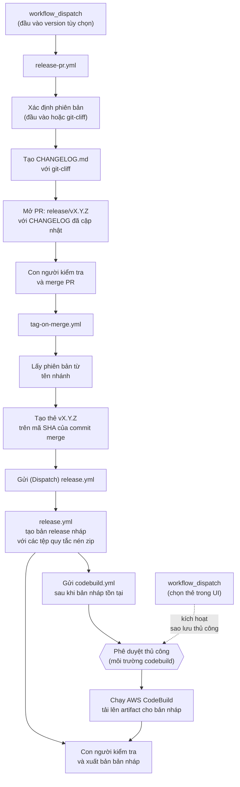
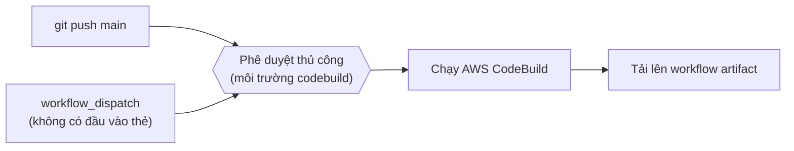
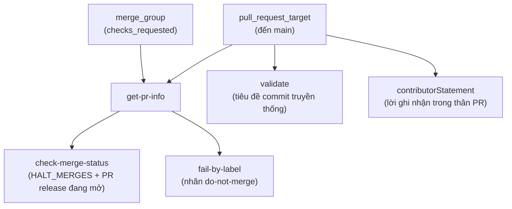

# Hướng dẫn Quản trị viên

Hướng dẫn này cung cấp tài liệu về cơ sở hạ tầng CI/CD, GitHub Workflows, các môi trường được bảo vệ, bí mật (secrets), biến (variables), quyền hạn, và quy trình phát hành cho kho lưu trữ `awslabs/aidlc-workflows`.

**Đối tượng:** Quản trị viên kho lưu trữ, người duy trì (maintainers), và các AI coding agents làm việc trên kho lưu trữ này.

**Tài liệu liên quan:**
- [Hướng dẫn dành cho Nhà phát triển](DEVELOPERS_GUIDE_VN.md) — Chạy các bản dựng cục bộ (CodeBuild + `act`)
- [Hướng dẫn Đóng góp](../CONTRIBUTING_VN.md) — Quy trình đóng góp và quy ước
- [README](../README_VN.md) — Hướng dẫn cài đặt và sử dụng dành cho người dùng

---

## Mục lục

- [Tổng quan về Kho lưu trữ](#tổng-quan-về-kho-lưu-trữ)
- [Kiến trúc CI/CD](#kiến-trúc-cicd)
- [Tham khảo Workflow](#tham-khảo-workflow)
  - [Release PR Workflow](#release-pr-workflow-release-pryml)
  - [Tag Release Workflow](#tag-release-workflow-tag-on-mergeyml)
  - [CodeBuild Workflow](#codebuild-workflow-codebuildyml)
  - [Release Workflow](#release-workflow-releaseyml)
  - [Pull Request Validation Workflow](#pull-request-validation-workflow-pull-request-lintyml)
- [Các Môi trường được Bảo vệ](#các-môi-trường-được-bảo-vệ)
- [Bí mật và Biến số](#bí-mật-và-biến-số)
- [Mô hình Quyền hạn](#mô-hình-quyền-hạn)
- [Tư thế Bảo mật](#tư-thế-bảo-mật)
- [Quyền sở hữu Mã nguồn](#quyền-sở-hữu-mã-nguồn)
- [Quy trình Phát hành](#quy-trình-phát-hành)
- [Cấu hình Changelog](#cấu-hình-changelog)

---

## Tổng quan về Kho lưu trữ

Kho lưu trữ này xuất bản phương pháp luận **AI-DLC (Vòng đời Phát triển Dựa trên AI)** dưới dạng một tập hợp các tệp quy tắc markdown trong thư mục `aidlc-rules/`. Cơ sở hạ tầng CI/CD xử lý:

- **Tích hợp liên tục (CI)** thông qua AWS CodeBuild (đánh giá và báo cáo)
- **Phân phối bản phát hành** thông qua GitHub Releases (các tệp quy tắc được nén zip)
- **Tạo changelog** thông qua git-cliff (changelog-ưu-tiên: cập nhật trước khi phát hành, bao gồm trong commit được gắn thẻ)

```
awslabs/aidlc-workflows/
├── .github/
│   ├── CODEOWNERS
│   ├── ISSUE_TEMPLATE/           # Biểu mẫu lỗi (Bug), tính năng, RFC, tài liệu
│   ├── pull_request_template.md  # Biểu mẫu PR với tuyên bố của người đóng góp
│   └── workflows/
│       ├── codebuild.yml         # CI thông qua AWS CodeBuild
│       ├── pull-request-lint.yml # Kiểm tra PR (tiêu đề, nhãn, cổng merge)
│       ├── release.yml           # GitHub Release khi push thẻ (tag)
│       ├── release-pr.yml        # PR changelog trước khi release
│       └── tag-on-merge.yml      # Tự động gắn thẻ khi merge PR release
├── aidlc-rules/                  # Sản phẩm có thể phân phối
│   ├── aws-aidlc-rules/          # Các quy tắc cốt lõi của quy trình
│   └── aws-aidlc-rule-details/   # Các quy tắc chi tiết theo giai đoạn
├── cliff.toml                    # Cấu hình changelog của git-cliff
├── docs/
│   ├── ADMINISTRATIVE_GUIDE_VN.md   # Tệp này
│   └── DEVELOPERS_GUIDE_VN.md       # Hướng dẫn build cục bộ
└── scripts/
    └── aidlc-evaluator/          # Framework đánh giá (đang phát triển)
```

---

## Kiến trúc CI/CD

Năm workflow tạo thành hai pipeline riêng biệt cộng với một cổng kiểm tra pull request:

### Pipeline 1: Phát hành (ưu tiên changelog)



Luồng phát hành **ưu tiên changelog (changelog-first)**: CHANGELOG được cập nhật *trước khi* thẻ (tag) được tạo, do đó commit được gắn thẻ luôn chứa mục nhập changelog của riêng nó. Luồng này có ba điểm tiếp xúc của con người:

1. **Merge release PR** — xem xét changelog, kích hoạt gắn thẻ tự động
2. **Phê duyệt môi trường CodeBuild** — cấp quyền truy cập vào thông tin xác thực AWS cho bản dựng
3. **Xuất bản release nháp** — xem xét các artifact, đặt release ở trạng thái công khai

`tag-on-merge.yml` gửi rõ ràng `release.yml` và `codebuild.yml` thông qua `gh workflow run --ref vX.Y.Z` sau khi tạo thẻ. Các dispatch này mang tính **tuần tự**: `release.yml` chạy trước và được theo dõi cho đến khi hoàn thành để bản release nháp tồn tại trước khi `codebuild.yml` tải lên các artifact. Điều này là cần thiết vì các thẻ được tạo bằng `GITHUB_TOKEN` không kích hoạt các sự kiện `on: push: tags` — nhưng `workflow_dispatch` thì không bị hạn chế này. Cả hai workflow cũng giữ nguyên `push: tags: v*` làm phương án dự phòng cho các lần đẩy thẻ thủ công. Workflow `codebuild.yml` yêu cầu **sự phê duyệt thủ công** thông qua môi trường được bảo vệ `codebuild` trước khi bản dựng tiếp tục. Bước tải lên xử lý linh hoạt mọi trạng thái release:
- **Đã có bản nháp** (trường hợp bình thường) — `release.yml` hoàn thành trong ~30s tạo ra bản nháp; CodeBuild mất vài phút, do đó bản nháp đã sẵn sàng khi thư mục artifact được tải lên
- **Chưa có bản release** (codebuild xong trước) — tạo bản nháp với các artifact của bản dựng; `release.yml` sẽ cập nhật lại nó sau
- **Đã xuất bản** (chạy lại) — cố gắng thay thế các artifact, đưa ra cảnh báo nhẹ nhàng nếu không thể thay đổi

**Chiến lược dự phòng:** Nếu CodeBuild chạy bởi thẻ gặp lỗi hoặc bị chặn, admin có thể kích hoạt thủ công thông qua `workflow_dispatch` và chọn thẻ `v*` ở giao diện GitHub UI (nhánh/thẻ). Vì `github.ref` phân giải thành thẻ đã chọn, bước tải lên sẽ tự động kích hoạt.

### Pipeline 2: Tích hợp Liên tục (CI)



### Pipeline 3: Kiểm tra Pull Request (PR)



`pull-request-lint.yml` chạy trên mọi PR nhắm đến nhánh `main` và trong danh sách hàng đợi (merge queue checks). Nó áp dụng 4 cổng chặn: chuẩn định dạng tiêu đề PR (conventional commits), thông báo xác nhận của người đóng góp từ mẫu PR, tham số đóng băng việc merge (configurable merge-halt), và kiểm tra nhãn `do-not-merge`. Nó dùng `pull_request_target` (thay vì `pull_request`) để quá trình workflow chạy trong ngữ cảnh của nhánh cơ sở (base branch) — điều này an toàn vì nó không bao giờ checkout code của PR.

---

## Tham khảo Workflow

### Release PR Workflow (`release-pr.yml`)

| Thuộc tính       | Giá trị                                             |
| ---------------- | --------------------------------------------------- |
| **Tệp**          | `.github/workflows/release-pr.yml`                  |
| **Trigger**      | `workflow_dispatch` với đầu vào `version` tùy chọn  |
| **Môi trường**   | _(không)_                                           |
| **Runner**       | `ubuntu-latest`                                     |

**Mục đích:** Tạo file `CHANGELOG.md` mới cập nhật từ conventional commits sử dụng git-cliff và mở PR tới một nhánh có cấu trúc `release/vX.Y.Z`. Đây là bước khởi đầu trong luồng ưu tiên changelog.

**Job: `release-pr` ("Tạo Release PR")**

| Bước | Tên                      | Hành động                                                                                                                                    |
| ---- | ------------------------ | -------------------------------------------------------------------------------------------------------------------------------------------- |
| 1    | Checkout code            | `actions/checkout` với `fetch-depth: 0` (lịch sử đầy đủ cho git-cliff)                                                                       |
| 2    | Cài đặt git-cliff        | `orhun/git-cliff-action` để làm cho CLI khả dụng                                                                                             |
| 3    | Xác định phiên bản       | Dùng `inputs.version` (kiểm tra chuẩn semver) hoặc `git-cliff --bumped-version` bắt tự động; dùng patch bump lưu từ thẻ mới nhất nếu rỗng    |
| 4    | Kiểm tra thẻ tạo chưa    | Trả lỗi sớm (fail early) nếu đích (target tag) đã tồn tại.                                                                                   |
| 5    | Generate changelog       | Dùng `orhun/git-cliff-action` kèm `--tag vX.Y.Z` sinh ra `CHANGELOG.md`                                                                      |
| 6    | Tạo release PR           | Kiểm tra xem nhánh exist (tồn tại) hay không, commit, đẩy nhánh `release/vX.Y.Z` và mở PR (kèm nhãn `release` nếu có trong kho lưu trữ)      |

**Phát hiện Phiên bản:** Nếu version được chỉ định, sẽ được validate semver (`MAJOR.MINOR.PATCH`); áp dụng với dạng `v0.2.0` lẫn `0.2.0`. Mặc định không truyền version thì nó sẽ dựa trên loại conventional commit thông qua `git-cliff --bumped-version`. Thiết lập cấu hình này cài trên phần `[bump]` tại tệp `cliff.toml` (ví dụ `feat` -> minor bump, breaking change -> major bump). Nếu chưa tìm thấy conventional commits, workflow tự động chuyển thông qua patch bump từ thẻ mới nhất. Còn lỡ chưa tạo thẻ nào, nó sẽ thoát an toàn với cảnh báo (không tạo PR nào).

**External actions (SHA-pinned):**

| Hành động                | Phiên bản | SHA                                        |
| ------------------------ | ------- | ------------------------------------------ |
| `actions/checkout`       | v6.0.1  | `8e8c483db84b4bee98b60c0593521ed34d9990e8` |
| `orhun/git-cliff-action` | v4.7.0  | `e16f179f0be49ecdfe63753837f20b9531642772` |

---

### Tag Release Workflow (`tag-on-merge.yml`)

| Thuộc tính       | Giá trị                                                 |
| ---------------- | ------------------------------------------------------- |
| **Tệp**          | `.github/workflows/tag-on-merge.yml`                    |
| **Trigger**      | `pull_request: types: [closed]`                         |
| **Điều kiện**    | PR đã được merge VÀ tên nhánh bắt đầu với `release/v`    |
| **Môi trường**   | _(không)_                                               |
| **Runner**       | `ubuntu-latest`                                         |

**Mục đích:** Tự động tạo thẻ (version tag) lúc sát nhập (merge commit) PR, ngay sau gọi qua (dispatch) vào `release.yml` (chờ hoàn tất) sau đó là tới `codebuild.yml`.

**Job: `tag` ("Tạo Release Tag")**

| Bước | Tên                                | Hành động                                                                                   |
| ---- | ---------------------------------- | ------------------------------------------------------------------------------------------- |
| 1    | Tạo thẻ                            | Trích xuất phiên bản từ tên nhánh, kiểm tra thẻ không tồn tại, tạo bằng API GitHub          |
| 2    | Dispatch release workflow và chờ   | `gh workflow run release.yml --ref $TAG --repo $REPO`, sau đó `gh run watch` cho tới khi xong|
| 3    | Dispatch codebuild workflow        | `gh workflow run codebuild.yml --ref $TAG --repo $REPO` (chạy sau release nháp xuất hiện)   |

**Tạo thẻ:** Dùng `gh api repos/.../git/refs` tạo lightweight tag (thẻ gọn).

**Workflow dispatch:** Các thẻ tạo với `GITHUB_TOKEN` vốn không kích hoạt được bộ gọi `on: push: tags`. Để giải quyết, `tag-on-merge.yml` đẩy trực tiếp lệnh `workflow_dispatch` (bỏ qua cấm chặn của GITHUB_TOKEN) thông qua `--ref $TAG` gọi vào quyền khởi động. Kết quả: hai workflows chạy trúng `github.ref = refs/tags/vX.Y.Z` — xử lý y mốc tag thực tế. Quá trình chia 2 thời điểm Dispatch (tuần tự): đợi (`--ref` chờ xong via `gh run watch` của `release.yml`) đến khi file nháp xuất hiện mở, bắt kịp vào tiến trình `codebuild.yml`.

**Bảo mật:** Tên `release/vX.Y.Z` cấu thành dạng biến (environment variable), không can thiệp nội dung chạy để vô hiệu command injection. Khối If dựa theo `github.event.pull_request.merged == true` đảm bảo các PR hợp nhất mới vào nhánh.

---

### CodeBuild Workflow (`codebuild.yml`)

| Thuộc tính       | Giá trị                                                                                                                                                    |
| ---------------- | ---------------------------------------------------------------------------------------------------------------------------------------------------------- |
| **Tệp**          | `.github/workflows/codebuild.yml`                                                                                                                          |
| **Triggers**     | `push` cho `main`, đẩy thẻ tag bắt đầu `v*`, loại `workflow_dispatch` (chi phối bởi `tag-on-merge.yml` hoặc chỉnh thao tác bằng tay ở UI)                  |
| **Môi trường**   | `codebuild` (được bảo vệ, cần cấp quyền tay phê duyệt)                                                                                                     |
| **Runner**       | `ubuntu-latest`                                                                                                                                            |
| **Đồng thời**    | Tách nhóm `{workflow}-{ref}`, loại bỏ tiến trình đang tiếp diễn (in-progress)                                                                              |

**Mục đích:** Vận hành lệnh xây dự án AWS CodeBuild, kéo tải các artifact thứ cấp, thứ cấp cơ sở từ ổ hệ S3. Tiến hành khóa trên cache nhờ qua GitHub Actions, rồi up lưu dạng file đính kèm workflow và đính luôn cho Release Github ở trạng thái `v*`.

**Job: `build`**

| Bước | Tên                          | Điều kiện                 | Hành động                                                       |
| ---- | ---------------------------- | ------------------------- | --------------------------------------------------------------- |
| 1    | Liệt kê cache                | _(luôn luôn)_             | `gh cache list` tra danh sách cache chứa project.               |
| 2    | Kiểm tra cache               | _(luôn luôn)_             | Kiểm tra nhanh qua `actions/cache/restore` (với `lookup-only` = true)           |
| 3    | Cấu hình Thông tin xác thực AWS| cache miss              | `aws-actions/configure-aws-credentials` cấu hình qua OIDC       |
| 4    | Thực thi CodeBuild           | cache miss                | build nội suy dòng cấu hình bằng `aws-actions/aws-codebuild-run-build`|
| 5    | ID Build                     | cache miss (luôn luôn)    | Print mã báo ID của bản Build phát CodeBuild                    |
| 6    | Tải bản artifact CodeBuild   | cache miss                | Tải nguyên cả hai luồng primary, secondary artifact thuộc S3    |
| 7    | Liệt kê artifact CodeBuild   | cache miss                | Hiển thị cấu trúc list và định lượng bên trong zip tải được      |
| 8    | Làm sạch cache report cũ     | cache miss                | Đòi xóa đi thứ hạng 3 cache cũ khớp kết quả tải theo đuôi nhánh |
| 9    | Lưu báo cáo vô bộ đệm        | cache miss                | Lưu kết quả đệm bằng `actions/cache/save` với khóa là `{project}-{branch}-{sha}`|
| 10   | Lưu bản gốc/primary artifact | `!env.ACT`                | Nén bản tải của loại artifact lên `{project}.zip`               |
| 11   | Lưu báo cáo đánh giá/evaluation|`!env.ACT`                | Lưu hành định dạng báo cáo dạng nén `evaluation.zip`             |
| 12   | Lưu báo cáo xu hướng (trend) | `!env.ACT`                | Lưu bản tổng xuất xu hướng với dạng `trend.zip`                |
| 13   | Upload Artifacts đến Release | kích hoạt ở thẻ tag chữ  `v*`| Đính tải nén trực tiếp vào bản nháp - đã qua Release hoặc dự bị GitHub    |

**Chiến lược cache định hướng:** Khóa dạng `{project}-{branch}-{sha}` phòng tránh tình trạng một commit của nhánh tự dựng đi dựng lại 2 lần. Do dính hit, chuỗi mã tắt ở nhịp từ phân đoạn 3–9.

**Xây dựng inline (Inline buildspec):** Lựa chọn đè hẳn lên tệp cũ file nhúng, Workflow đi làm một tệp thay thế `buildspec-override` trọn khối, nó gồm:
- Mở `gh` CLI (qua dnf) kèm `uv` (hệ thống cài đặt package cấu trúc của Python)
- Cấp ngữ cảnh của lệnh gọi cho Build đó có phải release(thẻ định sẵn), phát định ngầm(nhánh mặc định), phát tính năng trước (feature - pre-merge).
- Thiết lập định hướng của bộ ảo file trắc nghiệm đánh giá xu hướng và cấu hình report tạm dưới ổ file `.codebuild/` 
- Định nghĩa phân phối đầu ra dạng toàn trọn nguyên file là 1 primary artifact. Đi qua hai bộ xuất theo thuộc (`trend`, `evaluation`)

**Lỗi hạn độ tương thích khi load Artifact:** Hoạt động bị lặp vì do sử dụng thư viện v6 ở Action (không tương hợp chung đối với bộ test qua local [`act`](https://github.com/nektos/act)). Bị chốt hãm ở lệnh mở theo dạng cấm `!env.ACT`.

**Bộ Actions Bổ sung bên ngoài (tất cả SHA-pinned):**

| Hành động                               | Phiên bản| SHA                                        |
| --------------------------------------- | ------- | ------------------------------------------ |
| `actions/cache/restore`                 | v5.0.3  | `cdf6c1fa76f9f475f3d7449005a359c84ca0f306` |
| `aws-actions/configure-aws-credentials` | v6.0.0  | `8df5847569e6427dd6c4fb1cf565c83acfa8afa7` |
| `aws-actions/aws-codebuild-run-build`   | v1.0.18 | `d8279f349f3b1b84e834c30e47c20dcb8888b7e5` |
| `actions/cache/save`                    | v5.0.3  | `cdf6c1fa76f9f475f3d7449005a359c84ca0f306` |
| `actions/upload-artifact`               | v6.0.0  | `b7c566a772e6b6bfb58ed0dc250532a479d7789f` |

---

### Release Workflow (`release.yml`)

| Thuộc tính       | Giá trị                                                                                                               |
| ---------------- | --------------------------------------------------------------------------------------------------------------------- |
| **Tệp**          | `.github/workflows/release.yml`                                                                                       |
| **Triggers**     | `workflow_dispatch` (do gọi từ `tag-on-merge.yml`), ấn push qua thẻ (push tag) bắt đầu với `v*` (phương án phụ tag bằng tay) |
| **Môi trường**   | _(không)_                                                                                                             |
| **Runner**       | `ubuntu-latest`                                                                                                       |

**Mục đích:** Tạo nên một **bản Nháp (draft)** theo cấp GitHub Release bám với file thông số (aidlc-rules/ zip) khi mà bắt nhịp gọi trúng 1 lệnh Push của thẻ v*. Bản draft được giữ đấy cho CodeBuild đệm tệp để sau đó Review chờ đóng cọc thông báo xuất xưởng.

**Job: `release` ("Tạo Release")**

| Bước | Tên                           | Điều kiện            | Hành động                                                                                                                                           |
| ---- | ----------------------------- | -------------------- | --------------------------------------------------------------------------------------------------------------------------------------------------- |
| 1    | Tải source code/Checkout      | _(luôn luôn)_        | Check out sử dụng `actions/checkout` cùng thiết chế mở `fetch-depth: 0`                                                                             |
| 2    | Xuất trích xuất Version       | _(luôn luôn)_        | Bộ cản Guard chặn lại nếu `GITHUB_REF` không khớp đuôi là biến mác dạng `v*`, chuyển qua dòng Warning thông báo sau bỏ qua việc khác. Còn lại cắt định theo `version` (bỏ cữ v) & có thêm tag `tag` (còn `v`) |
| 3    | Tổng hợp tạo thông số Release | ref là một thẻ `v*`  | Chạy `zip -r ai-dlc-rules-v{VERSION}.zip aidlc-rules/`                                                 |
| 4    | Tạo GitHub Release            | ref là một thẻ `v*`  | Khởi động chèn với dạng tải lệnh Release kèm theo zip (`softprops/action-gh-release`), theo cấu hình draft bằng `draft: true`                       |

**Chệch cản nhánh một cách uyển chuyển (Graceful skip):** Vì quá trình phát sinh gọi bằng nhánh thay cho tag (VD click thẳng luồng bằng branch từ Main), chương trình chỉ quăng `::warning::` êm thấm để đóng việc chặn đỏ báo không cản cản trở cái UI.

**Chuẩn bị tên Release:** `AI-DLC Workflow v{VERSION}` (ví dụ: `AI-DLC Workflow v0.1.6`)

**External actions (SHA-pinned):**

| Hành động                     | Phiên bản | SHA                                        |
| ----------------------------- | ------- | ------------------------------------------ |
| `actions/checkout`            | v6.0.1  | `8e8c483db84b4bee98b60c0593521ed34d9990e8` |
| `softprops/action-gh-release` | v2.5.0  | `a06a81a03ee405af7f2048a818ed3f03bbf83c7b` |

---

### Pull Request Validation Workflow (`pull-request-lint.yml`)

| Thuộc tính       | Giá trị                                                                                          |
| ---------------- | ------------------------------------------------------------------------------------------------ |
| **Tệp**          | `.github/workflows/pull-request-lint.yml`                                                        |
| **Triggers**     | `pull_request_target` đến nhánh `main` (nhiều trạng thái như sửa đổi, đánh nhãn, mở ra,...); `merge_group` (soi nhóm chuẩn hợp/ checks_requested)|
| **Môi trường**   | _(không)_                                                                                        |
| **Runner**       | `ubuntu-latest`                                                                                  |
| **Đồng thời**    | Tách nhóm `{workflow}-{ref}`, cho thoát nhanh luồng xử lý chưa kết thúc                            |

**Mục đích:** Khảo duyệt PR xem coi thỏa không mới chuyển merge. Gắt gao buộc xài kiểu thông số đặt title (chuẩn hóa), chứa tuyên ngôn đóng góp, công cụ chặn hàng loạt cho tiến trình PR và soát bảng nhãn do-not-merge. Bắt hàng đội hợp lý (Merge queue) luôn.

**Vì sao chọn `pull_request_target`:** Do trigger dạng này chạy ngay ở nền hệ gốc `base branch` nên bảo đảm về hệ an toàn do chả phải Checkout Code hay lôi kéo về gì cả - chỉ check metadata mã tĩnh của title/ labels/ body. Nhờ nó giúp GitHub giữ chắc kết nối được tới nhánh bí mật/label riêng kể cả cái repo người sinh fork.

**Job: `get-pr-info`**

| Bước | Tên         | Hành động                                                                                                 |
| ---- | ----------- | --------------------------------------------------------------------------------------------------------- |
| 1    | Lấy thông tin PR| Trích số ID PR và mác nhãn trực thuộc cấu hình biến `pull_request_target`, hoặc xách dò dạng API lookup trực tiếp cho dòng `merge_group`|

Trả kết xuất (`Outputs`) con số ID đại danh bằng `pr_number` đi và dải nhãn hiệu `pr_labels` theo tiến lưu đồ ở dưới dòng. 

**Job: `check-merge-status` ("Kiểm tra Tình trạng Merge")**

Phụ thuộc vào `get-pr-info`. Điều kiện luồng cài `if: always()` để luôn thực hiện phòng khi upstream lỗi.

| Cờ chặn                   | Hành vi                                                                       |
| ------------------------ | ----------------------------------------------------------------------------- |
| Mở PR release            | Khóa lại mọi động tác merge nếu luồng release kia vẫn bật (Cản 2 bản release đua ra) |
| `HALT_MERGES = 0`        | Tự do cho sáp nhập toàn bộ (Mặc định).                                        |
| `HALT_MERGES = -N`       | Buộc đóng khóa toàn bộ mọi lệnh xử kết nối merge                              |
| `HALT_MERGES = N`        | Chỉ PR có tag trùng đúng con số luồng #N kia tiếp tục tiến sâu vô               |

**Job: `fail-by-label` ("Báo lỗi bằng Nhãn")**

Phụ thuộc `get-pr-info`. Luôn chạy `if: always()`. Tức tắc báo dừng nếu vướng lọt khung nhãn `do-not-merge` (lấy theo chỉ định tự mở cấu hình DO_NOT_MERGE_LABEL).

**Job: `validate` ("Xác thực Tiêu đề PR")**

Áo lệnh cho quá khứ thông số trigger kéo API bằng `pull_request`/`pull_request_target`. Áp dụng luân lý dòng action `amannn/action-semantic-pull-request` xử định luật ép phải biên chép cái list loại (conventional commit).

Dải cấu từ mồi chuẩn hợp: `fix`, `feat`, `build`, `chore`, `ci`, `docs`, `style`, `refactor`, `perf`, `test`. Bỏ buộc qua dải nhóm (như là: requireScope - thiết lập bằng false).

**Job: `contributorStatement` ("Yêu cầu Tuyên bố Đóng góp")**

Chỉ chặn ở ngõ Trigger `pull_request` & `pull_request_target`. Tự vứt skip tránh báo loạn các thẻ mã tạo của dạng luống Bot (dependabot[bot], github-actions...). Duyệt mã rà dòng lưu bằng chứng bảo lưu phân ngạch hợp cho lệnh khai mở PR ở tệp `.github/pull_request_template.md` (chứa dòng):

> By submitting this pull request, I confirm that you can use, modify, copy, and redistribute this contribution, under the terms of the project license.

**Hành động mở ngoài (external actions dạng SHA-pinned):**

| Hành động                               | Phiên bản| SHA                                        |
| --------------------------------------- | ------- | ------------------------------------------ |
| `amannn/action-semantic-pull-request`   | v6.1.1  | `48f256284bd46cdaab1048c3721360e808335d50` |
| `actions/github-script`                 | v8.0.0  | `ed597411d8f924073f98dfc5c65a23a2325f34cd` |

---

## Các Môi trường được Bảo vệ

| Môi trường  | Sử dụng bởi                 | Mục đích                                      |
| ----------- | --------------------------- | --------------------------------------------- |
| `codebuild` | `codebuild.yml` job `build` | Có ngạch quản lý cho cơ chế truy thu nhận quyền dữ kiện Credentials vào bên trong tài khoản AWS chạy theo bản CodeBuild |

Bảo môi trường khép lại theo một khối duy nhất `codebuild`, nó tích chứa các phân khu:
- Cấu hình thẻ Secret tên `AWS_CODEBUILD_ROLE_ARN` đi lấy mác thông tin luồng ARN OIDC-Based dùng tại quá trình gọi ngạch quyền trên STS.
- Hàng dãy tập lệnh có đi với biến cấu hình định dải repo ở các cấp: `CODEBUILD_PROJECT_NAME`, `AWS_REGION`, và thông số định số biên dải `ROLE_DURATION_SECONDS`

Một số điều cấu tạo ranh giới bao vệ gồm (nhánh cấp người xử hay nhánh bảo vệ giới hạn - reviewer & branch restriction).

---

## Bí mật và Biến số

### Bí mật (Secrets)

| Bí mật                   | Phạm vi                     | Sử dụng bởi                                         | Mục đích                                                                                       |
| ------------------------ | --------------------------- | --------------------------------------------------- | ---------------------------------------------------------------------------------------------- |
| `AWS_CODEBUILD_ROLE_ARN` | Môi trường (`codebuild`)    | `codebuild.yml`                                     | Chứa cụm chốt IAM Role ARN (OIDC-Based)                                                        |
| `GITHUB_TOKEN`           | Tự động (do GitHub tạo)     | `release.yml`, `release-pr.yml`, `tag-on-merge.yml`, `pull-request-lint.yml` | Dành mở lối làm hành chuẩn xác hệ cho dải quy cũ thông GitHub (như mở release, up PR tag)|

Luồng công việc `codebuild.yml` cũng sử dụng `github.token` (token tự động, không có tiền tố `secrets.`) để quản lý bộ đệm thư mục chạy ngầm tự cache và up Artifact file cho Release.

### Biến số Kho lưu trữ (Repository Variables)

| Biến                      | Sử dụng bởi             | Fallback Mặc định   | Mục đích                                                         |
| ------------------------- | ----------------------- | ------------------- | ---------------------------------------------------------------- |
| `CODEBUILD_PROJECT_NAME`  | `codebuild.yml`         | `codebuild-project` | Tên của dự án AWS CodeBuild                                      |
| `AWS_REGION`              | `codebuild.yml`         | `us-east-1`         | Khu vực (Region) chạy AWS CodeBuild và lấy mã khoá bảo STS      |
| `ROLE_DURATION_SECONDS`   | `codebuild.yml`         | `7200`              | Khoản cấu hình chạy khung mở bảo STS                             |
| `DO_NOT_MERGE_LABEL`      | `pull-request-lint.yml` | `do-not-merge`      | Tên nhãn mà báo sẽ khoá cản thao tác sáp nhập lệnh trên (Merge)  |
| `HALT_MERGES`             | `pull-request-lint.yml` | `0`                 | Khóa đóng chặn: `0` = bỏ cấm hết, `-N` = Khóa dải hoàn, `N` = Để hở chỉ có nhánh thẻ của số PR được đánh lệnh #N cho rẽ nhanh|

Nhóm biến cài thế thiết chốt dựa thuật mở thông dải `${{ vars.VAR || 'default' }}`, nó bảm bảo không khai thì dòng tự có mã giá trị thay luôn để đỡ hỏng dòng chạy.

---

## Mô hình Quyền hạn

### Quyền hạn cấp Workflow

| Workflow                | Quyền hạn                                 |
| ----------------------- | ----------------------------------------- |
| `codebuild.yml`         | Cài chế độ không có quyền `none` cho toàn 16 nhóm mở đầu|
| `pull-request-lint.yml` | Cài chế độ không có quyền `none` cho toàn 16 nhóm mở đầu|
| `release.yml`           | `contents: write`                         |
| `release-pr.yml`        | `contents: write`, `pull-requests: write` |
| `tag-on-merge.yml`      | `contents: write`, `actions: write`       |

### Quyền hạn cấp Job (Ghi đè - Override)

| Workflow                | Job                    | Quyền hạn                                              | Rationale (Mục đích lý luận)                                   |
| ----------------------- | ---------------------- | ------------------------------------------------------ | -------------------------------------------------------------- |
| `codebuild.yml`         | `build`                | `actions: write`, `contents: write`, `id-token: write` | Phân cấu bộ nhớ cache, đánh cắp thông và quyền uỷ ARN vào bảo màng AWS STS |
| `pull-request-lint.yml` | `get-pr-info`          | `contents: read`, `pull-requests: read`                | Dán lấy dải nội bộ cấp Label bằng giao tiếp liên Application (API)|
| `pull-request-lint.yml` | `check-merge-status`   | `pull-requests: read`                                  | Xác quy trình cấm khóa dòng cổng ngõ                               |
| `pull-request-lint.yml` | `validate`             | `pull-requests: read`                                  | Lọc PR xem tựa đúng câu chuẩn hóa conventional chưa                |
| `pull-request-lint.yml` | `contributorStatement` | `pull-requests: read`                                  | Mở phần chữ body PR coi lại chuẩn thông cáo lưu của tác giả.         |

Mẫu phân hóa thiết chốt (`codebuild.yml` & `pull-request-lint.yml`) thực hiện môt phương chi quy chế: Khóa bằng sạch xong bật từ từ `(deny-all-then-grant)` mở chỉ lấy đặc hạn mức cấp thiết cho dòng Workflow (job - level). Tránh các đợt cài đột rủi ro mạn quyền dâng trên mức quyền hạn.

---

## Tư thế Bảo mật

| Kiểm soát                   | Triển khai                                                                                                                                                        |
| --------------------------- | ----------------------------------------------------------------------------------------------------------------------------------------------------------------- |
| **Bảo vệ mã chuỗi cung ứng**| Hệ Action điều hướng gọi ở nguồn API ngoài bằng chuẩn bóc SHA chốt khóa (không cho thay bằng biến Tags mutable)                                                   |
| **Xác thực AWS**            | Xác lý đóng quyền theo kiểu Role OIDC giải quyết tại `id-token: write` không có chìa khoá bí mật ở dạng hệ lưu cố định                                           |
| **Mở khoá vòng kim cô ngầm**| Hệ `codebuild.yml` ngắt đủ 16 lệnh dải không chạy nếu nằm ngước lại bằng `pull-request-lint.yml`, không sinh bất cứ điều kiện vô định cho một bản Workflow       |
| **Bảo vệ ranh giới định kỳ**| Môi trường `codebuild` có lệnh duyệt người tham soát/ hay cản hệ thống rẽ dải bảo biên (review/branch restrict)                                               |
| **Loại bỏ đồng bộ hóa lặp** | Hệ cản hủy dòng chạy chốt trùng song mã song trình rẽ vào ở nhánh, xử gẫy lệnh trùng với `codebuild.yml` và `pull-request-lint.yml`                             |
| **Trigger kiểm theo PR nháp**| Đọc từ bộ ngạch an toàn `pull_request_target` không lấy đi file checkout PR có khả năng gây ra nguy hại, giải dải lấy file tĩnh (title, body, labels)           |
| **Cản dòng mã chèn**        | Biến số do dạng chèn đẩy từ Event trigger dải kiểu `env` giúp dọn cản rủi ro khi lệnh Command lọt dải `run:`                                                  |
| **Thẻ quyền sở hữu khoá**   | Chủ bộ kho `.github/` đi lệnh ở các mã Action, Codeowners thuộc sở thẩm tự quản cấp cao từ nhóm (`@awslabs/aidlc-admins`)                                    |
| **Dấu lưu bảo account**     | Tạo luồng giấu chuẩn account cấu AWS định dạng `mask-aws-account-id: true` ẩn trên giao diện Action                                                               |

---

## Quyền sở hữu Mã nguồn

Được định nghĩa trong tệp `.github/CODEOWNERS`:

| Đường dẫn                                     | Người sở hữu                                                                  |
| --------------------------------------------- | ----------------------------------------------------------------------------- |
| `*` (mặc định)                                | `@awslabs/aidlc-admins` `@awslabs/aidlc-maintainers`                          |
| `.github/`                                    | `@awslabs/aidlc-admins`                                                       |
| `.github/CODEOWNERS`                          | `@awslabs/aidlc-admins`                                                       |
| `aidlc-rules/`                                | `@awslabs/aidlc-admins` `@awslabs/aidlc-maintainers` `@awslabs/aidlc-writers` |
| `assets/`                                     | `@awslabs/aidlc-admins` `@awslabs/aidlc-maintainers` `@awslabs/aidlc-writers` |
| `scripts/`                                    | `@awslabs/aidlc-admins` `@awslabs/aidlc-maintainers`                          |
| `CHANGELOG.md`, `cliff.toml`, `LICENSE`, v.v. | `@awslabs/aidlc-admins`                                                       |

**Lưu ý quan trọng:** Chỉ nhóm bảo trợ thuộc danh `@awslabs/aidlc-admins` được tự mở/phê đê qua mã quy trình luồng nội cấp phân của `.github/` (VD như file nội bộ `CODEOWNERS`).

---

## Quy trình Phát hành

Phát hành bám quy lưu đổi cấu "Changelog - ưu tiên", tức: cập nhật trên dạng mã lịch sử của thông báo changelog xong (bản chuẩn đổi cấu), sinh chèn tiếp theo dạng chốt chặn sự kiện với (tag thẻ/tagged). 3 điểm gọi xác nhận thực của người điều hướng gồm: hợp dòng PR, cấp quyền bật thiết chế bản môi trường AWS tại (codebuild), và mở trạng thái thả xuất (Release).

1. **Khắc khởi tạo Release PR workflow** từ môi trường lệnh qua Action GitHub ngoài UI:
   - Truy xuất tới tab Action → Chọn thẻ Release PR → Click `Run workflow`
   - Ký gửi các cấu tự ví dụ bản phiên mới (`0.2.0`), có thể xài lệnh cho qua trống để tính dựa tự động sinh version từ (conventional commits)
   - Tệp mã `release-pr.yml` chèn làm mới nội biến `CHANGELOG.md` cho lưu tạo phân vào một dòng rẽ `release/v1.2.0`, đai cấu PR ở loại có mác bảo (nhãn / label `release`)

2. **Duyệt xem cho xác nhận PR hợp bản:**
   - Dò đúng câu giải dòng phân bố cho đoạn chữ theo đúng kết quả changelog.
   - Trộn nhánh ghép PR (Cần thông thẻ chuẩn ở dạng yêu cầu vì do `CHANGELOG.md` bảo mật riêng quyền chỉ bởi @awslabs/aidlc-admins)
   - `tag-on-merge.yml` mở chốt đính lưu đính lưu qua commit mới tạo bằng thẻ tag lưu dạng v1.2.0. Nó dóng sang tiếp nhịp tự đẩy bộ công cụ lưu Codebuild và khởi nguyên.

3. **Luồng làm việc `release.yml` mở ngầm ngay sau đó** (Gọi nhịp dispatch `tag-on-merge.yml` đè biến tên nhánh (`--ref v1.2.0`)):
   - Khép ZIP folder `aidlc-rules/` gộp dạng lại kiểu tên `ai-dlc-rules-v1.2.0.zip`
   - Lập một bản có phân trạng thái **nháp (draft)** GitHub Release cấu dạng (tên gọi "AI-DLC Workflow v1.2.0") tải zip này để cho đính bám cùng.

4. **Kích dòng chuẩn bị xây mã Codebuild bằng file thiết `codebuild.yml`** (Thông thường do đẩy từ `tag-on-merge.yml` nhưng chỉ tiếp sau do cấp qua xác quyết qua môi trường chuẩn `codebuild` phê bằng tay):
   - Vào thực thi ở CodeBuild thông qua lệnh khóa từ thẻ tag đã up.
   - Giải và trích nội dòng lưu bao cho bản gốc thứ chính, báo bản thông đánh giá (evaluation) & thông định (trend)
   - Chập các folder nén ZIP kéo giải với một tập thông lưu của bản phát thả cấu nháp trên. Trường hợp lệch thời không, rẽ tự lập nháp luôn (giả đi file chạy bản 3 còn kẹt chưa ra).

5. **Xuất xưởng thả thông Release** ấn xác nhập nút tại Github thông giao "Publish release":
   - Xác chuẩn xem mọi File tệp tải từ mã bản có đúng lượng cần để lên xuất bản? (quy tắc rules nén chung File đánh giá auto chạy).
   - Duyệt note của Note thư báo thay đổi bản mới xong lưu cấu hành.

**Lưu ý:** Lệnh ngách chặn của thiết `codebuild` bị chặn trên nhánh khi cho nhánh chạy ngầm, bạn đi rà bằng cách cấu chế bảo vệ tại Deployment branch, kéo thả lại `main` mở cho `v*`. Thể cách của nó khiến trigger đính tag thoát cổng lưu.

---

## Cấu hình Changelog

Nằm rải tại nội khung `cliff.toml` (do nhóm lưu của `release-pr.yml` giải ra):

| Cài đặt               | Giá trị                                                 |
| --------------------- | ------------------------------------------------------- |
| **Định dạng commit**  | Conventional commits (`feat:`, `fix:`, `docs:`, v.v.)   |
| **Cú pháp thẻ tag**   | `v[0-9].*`                                              |
| **Loại bộ tự sắp gộp**| Bắt loại cữ cũ giải đi đầu (Oldest first)               |

**Ngạch phân bổ giải (Commit groups):**

| Mã dán Prefix | Gọi danh tính Group  |
| ------------- | ------------- |
| `feat`        | Tính năng (Features)       |
| `fix`         | Cập nhập Sửa Lỗi (Bug Fixes)        |
| `docs`        | Bản Nội Lưu/Tài Liệu (Documentation)|
| `perf`        | Phát tính Năng lượng hiệu suất (Performance)|
| `refactor`    | Chỉnh/Tái giải Mã Code (Refactoring) |
| `style`       | Nhịp Điệu Dòng / Cấu hình Code (Style)      |
| `test`        | Thẻ Thử (Tests)            |
| `build`       | Hệ Phát Lưu/Bản triển CI/CD(CI/CD)          |
| `ci`          | Bản chuyển phát liên hệ CI/CD(CI/CD)        |
| `chore`       | Tạp Nhiệm Thường nhật(Miscellaneous)|

**Phân bộ lọc Filter:**

| Mô thức Pattern          | Điều hướng (Action)                        |
| ------------------------ | ------------------------------------------ |
| `docs: update changelog` | Hủy (Giảm đi cấu lưu rác sinh ra bởi chuỗi thông release) |

Có chức năng `filter_unconventional = true` dọn rác các chuỗi lưu code k tuân loại format phân hóa.

**Giải biến số làm nảy vòng lặp Tag version** (Cấu thành thiết ở `[bump]` section):

| Luồng thiết lệnh                             | Báo hiệu/Xử lý hành tính                      |
| -------------------------------------------- | --------------------------------------------- |
| `features_always_bump_minor = true`          | `feat:` giải mã nhích nhẹ đuôi `minor version` |
| `breaking_always_bump_major = true`          | Có thể phá vỡ, nâng mức đổi biến bản lưu sang cấu bậc bản cao `major version`|

Nguyên quy này do giải cơ thiết bởi dòng lệnh qua Terminal (`git-cliff --bumped-version`) tự nhảy version thay đổi cho bản `release-pr.yml`.
